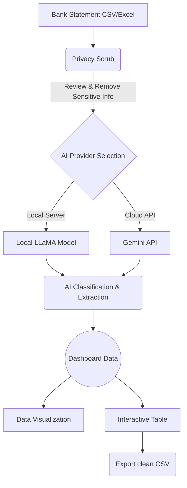

<div align="center">
  <h1>DhanRakshak</h1>
  <p><i>धन रक्षक — "Guardian of Wealth"</i></p>
  <p><b>An intelligent, privacy-first personal finance dashboard that categorizes your bank statements using Local AI or Gemini.</b></p>

  [](https://streamlit.io/)
  [](https://pandas.pydata.org/)
  [](#-privacy--security)
</div>

---

## Features

- **Smart Transaction Analysis**: Upload bank statements (`.csv`, `.xlsx`, `.xls`) and let AI intelligently categorize your transactions into clean, understandable segments.
- **100% Privacy-First Architecture**: Choose between Google's Gemini API or a **Local LLaMA model** for ultimate privacy. We strongly recommend Local LLMs!
- **Interactive Dashboard**: Beautiful, rich visualizations including:
  - Income vs Expenses overview
  - Expense distribution by category (pie charts)
  - Spending by payment method (bar charts)
  - Daily spending trends (line graphs)
- **Mandatory Privacy Scrub**: A built-in privacy step allowing you to manually strip out sensitive data (like your address or IFSC code) before analysis.
- **Editable Transactions**: Review and fine-tune transaction remarks and categories directly within the interface.
- **Export Capability**: Download your analyzed and annotated statements as a clean CSV file.

## Getting Started

### Prerequisites
- Python 3.7 or higher
- pip (Python package installer)
- (Optional but Recommended) LM Studio, Ollama, or any local inference server for Local AI setup.

### Installation

1. **Clone the repository**
   ```bash
   git clone https://github.com/TheRealNeelaksh/DhanRakshak.git
   cd DhanRakshak
   ```

2. **Create a virtual environment** (recommended)
   ```bash
   python -m venv venv
   source venv/bin/activate  # On Windows: venv\Scripts\activate
   ```

3. **Install dependencies**
   ```bash
   pip install -r requirements.txt
   ```

4. **Set up environment variables** (optional for Gemini)
   Create a `.env` file in the project root for storing sensitive information:
   ```env
   GEMINI_API_KEY=your_gemini_api_key_here
   ```

### Running the Application

```bash
streamlit run app.py
```
*The application will open in your default web browser at `http://localhost:8501`.*

---

## How It Works (Architecture)



## Usage Guide

### 1. Upload Statement
- Choose between running AI on a new statement or visualizing an already processed CSV.
- Upload your `.csv`, `.xlsx`, or `.xls` file. A [sample statement](sample_statement.csv) is provided in the repository for testing!

### 2. Configure AI Provider & Privacy
Choose your preferred AI provider in the sidebar:
- **Local Server (Highly Recommended)**: Uses a local model running on your machine (via LM Studio, Ollama). 100% privacy, data never leaves your device.
- **Gemini API**: Uses Google's Gemini 2.5 Flash model. 
- **Custom Endpoint**: Connect to a custom OpenAI-compatible endpoint.

> [!WARNING]  
> **Privacy Risk**: Using online hosted APIs like OpenAI, Claude, or Gemini involves sending your bank statements to third-party servers. We require explicit confirmation to use these services. **For maximum security, always use a Local Server.**

### 3. Privacy Scrub
- For CSV files, review the raw text and delete any PII (Personally Identifiable Information) like addresses, account numbers, or IFSC codes. This step is mandatory to ensure safety.

### 4. Review & Export
- Explore the generated insights, edit the AI's categories if needed, and export your organized data!

---

## Transaction Categories

DhanRakshak automatically groups your financial life into standard, easy-to-understand buckets:

| Category | Description |
|---|---|
| **Shopping** | E-commerce, retail, clothing, electronics |
| **Food** | Restaurants, Zomato/Swiggy, cafes, groceries |
| **Entertainment** | Movies, streaming subscriptions, gaming |
| **Travel** | Uber, flights, hotels, train tickets |
| **Utilities** | Electricity, water, internet, phone bills |
| **Health & Wellness** | Pharmacies, hospital visits, fitness |
| **Investments** | Mutual funds, stocks, crypto |
| **Security Net** | Insurance, emergency savings |
| **Self Transfer** | Inter-bank personal transfers |
| **Family & Personal** | Transfers to family members or friends |
| **Miscellaneous** | Uncategorized or rare transactions |
| **Income** | Salary, freelance payments, interest |

## Technology Stack
- **Frontend/UI**: Streamlit
- **Data Engine**: Pandas, NumPy
- **Visualizations**: Plotly Express
- **AI Integration**: Google Generative AI, LLaMA (Local)
- **Utilities**: python-dotenv, openpyxl, xlrd

## Contributing
Contributions are always welcome! Feel free to open an issue or submit a Pull Request.

## License
This project is available for personal use and modification. Please check with the repository owner for specific license terms.

## Author
**Neelaksh Saxena**

---
> *“Take control of your finances, before they take control of you.”*
